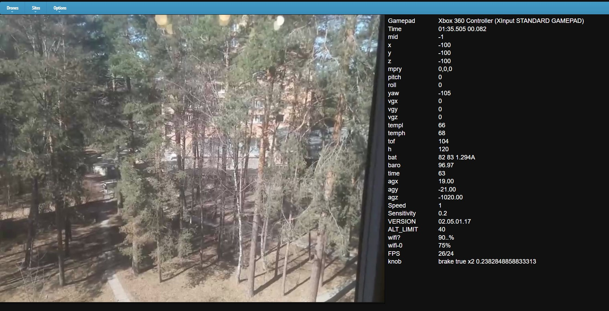

<pre>
Nodejs project to control the following drones: DJI Tello, WLtoys q343.

Version
  1.0

Installation (Linux,Windows)
  Install nodejs (testing node v16.14.0)
  Clone this repository 
  cd ddd 
  npm i 
  connect APP-HOST to drone wifi ap
  change drone hw addr in drone/tello-edu.js, tello-white.js, q343-blue.js, q343-green.js (ping 192.168.10.1;arp -a) or remote it
  node app.js 
  chrome http://APP-HOST:3549/

Usage
  You can use T4PRO joystick, usb gamepad, keyboard to control drone.

  Keys:
  t       Takeoff
  l       Land 
  q       Exit app
  w/s     Up/Down
  a/d     Rotate
  x/X     Camera on/off
  v/V     Select camera (downvision)
  Arrays  Forward/Left/...
  Escape  Line command mode
  1..0    Set sensitivity from 0.1 to 1.0
  ...

  Command mode:
  alt h   altitude limit
  180     rotate 180
  ...     sdk tello command 

Current State
  q343    на ремонте
  tello   ok

License
  See LICENSE.
  This project is an open-source project on GitHub released under the terms of an MIT License.
  You are required to include the following links and copyright notice:
  green5@2022 Rust
  in every copy or modified version of this work, and to display that notice on every web page or computer that it runs on.

Links
  https://github.com/damiafuentes/DJITelloPy.git - damiafuentes/DJITelloPy: DJI Tello drone python interface using the official Tello SDK. Feel free to contribute!
  https://gobot.io/blog/2018/04/20/hello-tello-hacking-drones-with-go
  https://gitlab.com/Suphi/Tello.git - Suphi / Tello · GitLab - GTK project
  https://blog.horner.tj/hacking-chinese-drones-for-fun-and-no-profit/ - Взлом китайских дронов ради развлечения и (без) прибыли
  
Support
  Пока на https://telegram.me/dji_tello.

TODO
  Много ...

Example

</pre>
